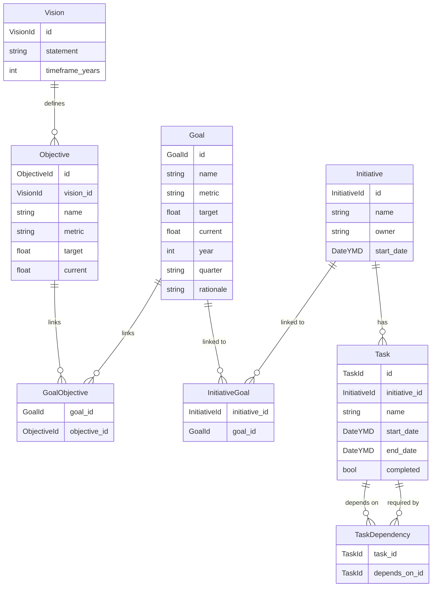

# Entities

The following is the UML diagram that illustrates the relationships between the entities in this project:

```mermaid
erDiagram

    Vision {
        VisionId id
        string statement
        int timeframe_years
    }

    Objective {
        ObjectiveId id
        VisionId vision_id
        string name
        string metric
        float target
        float current
    }

    Goal {
        GoalId id
        string name
        string metric
        float target
        float current
        int year
        string quarter
        string rationale
    }

    Initiative {
        InitiativeId id
        string name
        string owner
        DateYMD start_date
    }

    Task {
        TaskId id
        InitiativeId initiative_id
        string name
        DateYMD start_date
        DateYMD end_date
        bool completed
    }

    GoalObjective {
        GoalId goal_id
        ObjectiveId objective_id
    }

    InitiativeGoal {
        InitiativeId initiative_id
        GoalId goal_id
    }

    TaskDependency {
        TaskId task_id
        TaskId depends_on_id
    }

    %% Relationships
    Vision ||--o{ Objective : "defines"
    Objective ||--o{ GoalObjective : "links"
    Goal ||--o{ GoalObjective : "links"
    Goal ||--o{ InitiativeGoal : "linked to"
    Initiative ||--o{ InitiativeGoal : "linked to"
    Initiative ||--o{ Task : "has"
    Task ||--o{ TaskDependency : "depends on"
    Task ||--o{ TaskDependency : "required by"
```
